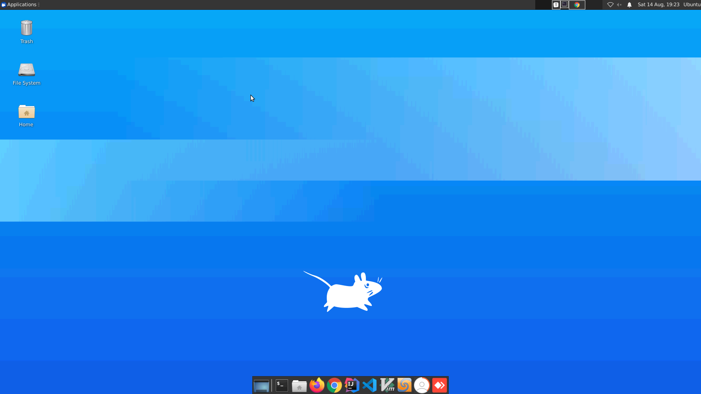

# Remdev on Azure

Spawns a remote desktop environment in the cloud in one go. 
The setup takes approximately 10 minutes before your *remdev* is ready to use. 



## How to start

You need an Azure account and have the azure cli installed.
To start the remote desktop environment run:

````bash
$ ./start.sh
````

Once the script is finished it will print the IP address of the spawned machine. You should be able to connect to it via ssh right away, as the azure cli automatically adds your ssh key. But it will take a couple more minutes and reboots for everything to install. 

You can follow the process in this log

```bash
$ tail -f /var/log/cloud-init-output.log
```

After it is finished you can use the [X2Go Client](https://wiki.x2go.org/doku.php/download:start) to connect to it.

To destroy the machine again run:

```bash
$ ./stop.sh
```

## Use for mob programming

Once connected you could start Anydesk on the remdev to allow more people join your session. Another possibility would be to use X2Go Desktop Sharing to have other people connect. In the bottom panel find the *Mob Timer* for facilitation.

## Installed Software

Based on Ubuntu Server 20.04 LTS

- xubuntu-core (Lightweight, minimal xfce4)
- Docker

### Python

- Python 2
- Python 3.8
- pip
- PyCharm

### Java

- sdkman
- AdoptOpenJDK 17
- Maven
- Gradle

### CSharp

 - dotnet 6

### JavaScript

- nvm
- latest node+npm
- yarn

### Development Tools

- git
- lazygit
- IntelliJ Ultimate
- Rider
- VS Code
- Vim
- Typora
- Meld
- Mob Timer

### Browsers

- Firefox
- Google Chrome

### Remote Desktop Servers

- X2Go
- Anydesk

## Motivation

The goal is to take away the impediments of setting up a development environment for remote collaborative practice or work. To have everybody connect to the same computer with minimal friction or latency and a great experience. While there are similar setups available for Windows I wanted to do the same for Linux.

### Inspirations

This work is inspired by [@jaybazuzi](https://twitter.com/jaybazuzi) and [@LlewellynFalco](https://twitter.com/LlewellynFalco) who do a similar [thing](https://github.com/JayBazuzi/machine-setup) but Windows based. And [Harald Reingruber](https://twitter.com/Harald3DCV), a friend of mine who also worked on [this Idea](https://github.com/mob-programming-meetup/cloud-desktop) for his mob programming meetup.
